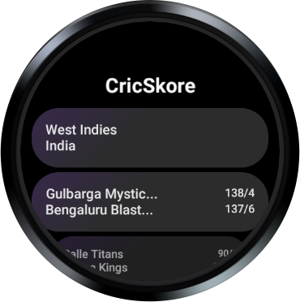
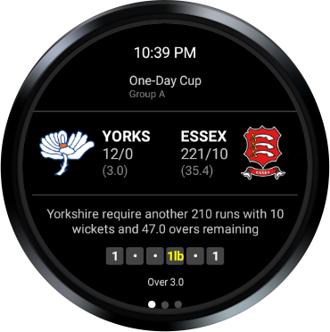
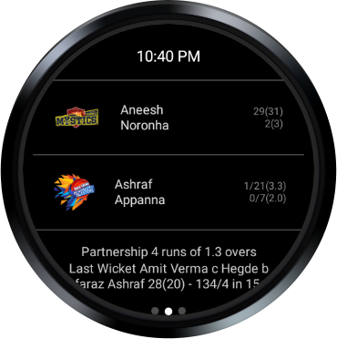
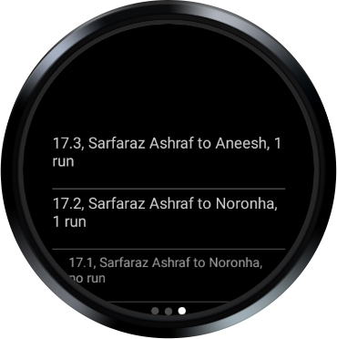

    
    <h1>CricSkore</h1>
    
A wearos app for live cricket scores

---

	

		
		
	

	

		
		
	

---

## Features

- Get score for all live games
- Pin favorite scorecard to the top of list
- Supports auto refresh after an interval or pull to refresh the scorecard
- Ball by ball commentary (up to a certain limit)
- Soon...

## How to install

- Download the [latest apk]("https://github.com/pipo2tr/cricskore/releases)
- [Google](https://www.google.com/search?q=how+to+sideload+apps+on+wear+os)
  /[Youtube](https://www.youtube.com/results?search_query=How+to+sideload+app+on+wearos)
